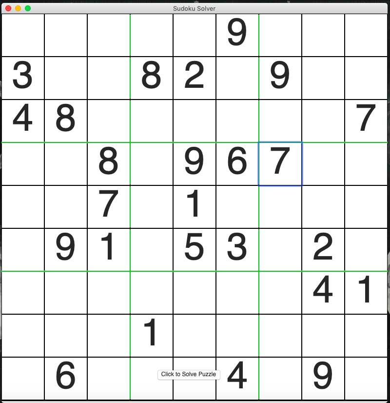
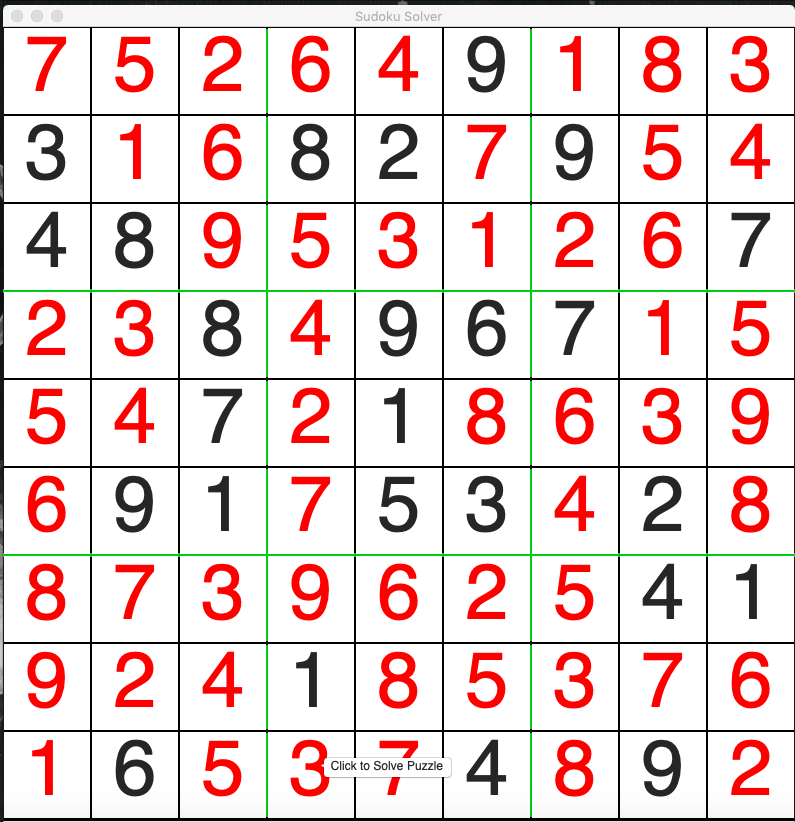

Sudoku solver
---------------------------
Made using python (wxPython for gui)

**WIP**

Currently works on most puzzles (easy, medium, & difficult)

Note that some puzzles do not work (currently working on making the solver better)

To View Project
---------------------------
- download zip
- navigate to downloaded folder using command line interface (terminal)
- to open project, use command: pythonw sudoku_solver.py
note: you must have python installed

Put the numbers of the sudoku puzzle you are trying to solve into their corresponding squares and hit the 'Click to Solve Puzzle' button

Screenshots
---------------------------

**Sudoku Puzzle**

Difficult level puzzle from sudoku.com

**Entered puzzle numbers into GUI**

**Solved puzzle**

