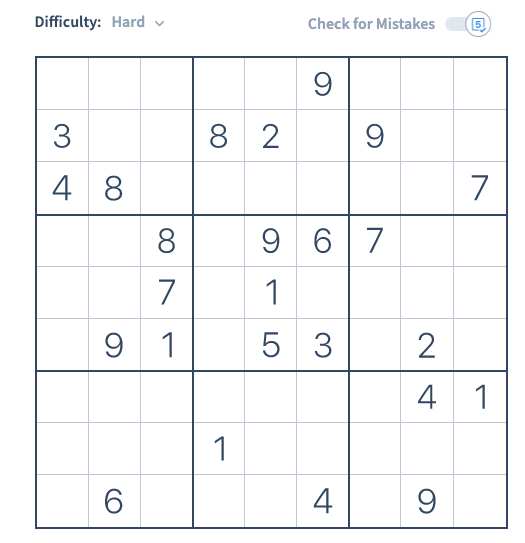
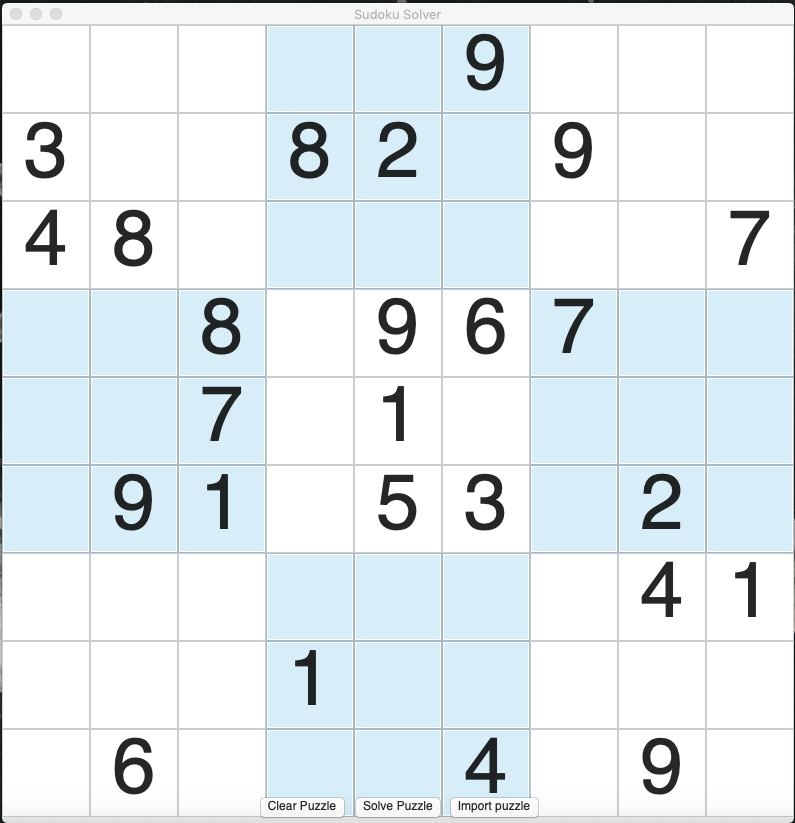
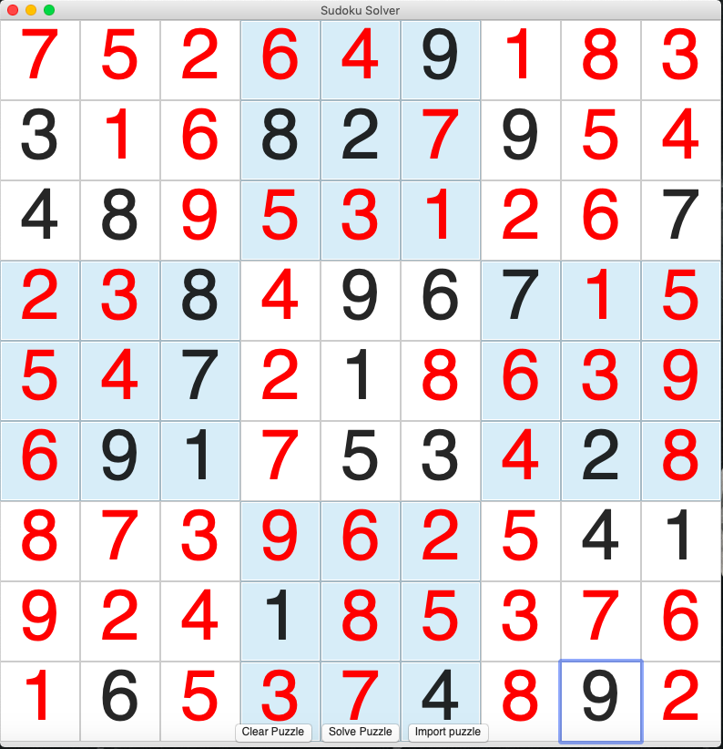

Sudoku solver
---------------------------
Made using python (wxPython for gui, text editor: Atom)

Currently works on most puzzles (easy, medium, & difficult)

Use https://qqwing.com/generate.html to generate puzzles in the correct format for using the "Input Puzzle" button (change 'Output format' to 'One line').

At first made a simple solver where the puzzle continuously iterates through the squares and narrows down the possible square values by looking at values in the current row, column, and box. Then added where the solver would determine if a square has to have a particular value because none of the other squares in the current row, column, or box could have that value. This works on most puzzles on Sudoku.com. However, it did not work on expert puzzles where inference was needed. To fix this, I added a recursive brute force algorithm that only runs when no solution is found using the previously mentioned approach. 
Brute force algorithm used is called Backtracking (described here: https://en.wikipedia.org/wiki/Sudoku_solving_algorithms) 

Need to go through and optimize time/space complexity in the program

To View Project
---------------------------
- download zip
- navigate to downloaded folder using command line interface (terminal)
- to open project, use command: pythonw sudoku_solver.py
note: you must have python installed

Put the numbers of the sudoku puzzle you are trying to solve into their corresponding squares and hit the 'Click to Solve Puzzle' button. Or import a puzzle with the format described above (use '.' for blank spaces and one of '123456789' for numbers, and enter 81 values)

Screenshots
---------------------------

**Sudoku Puzzle**

Difficult level puzzle from sudoku.com

**Entered puzzle numbers into GUI**

**Solved puzzle**

